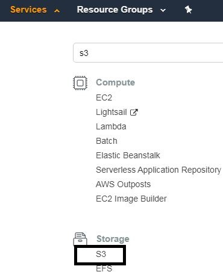
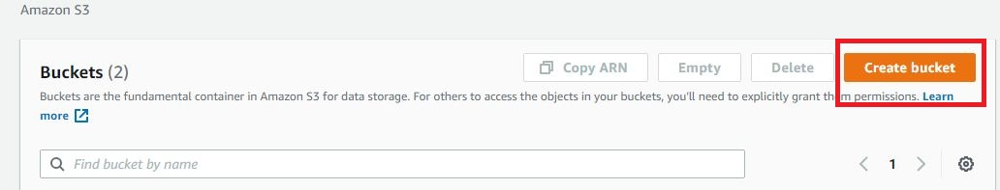
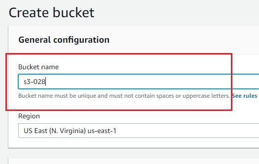
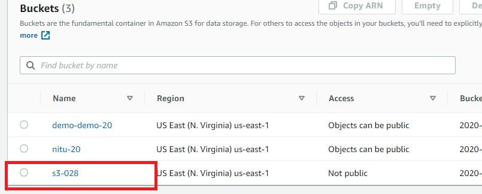
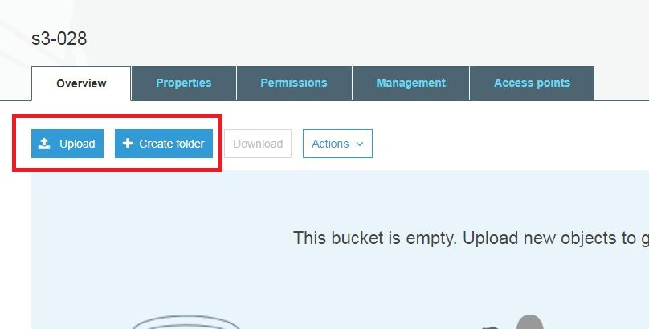
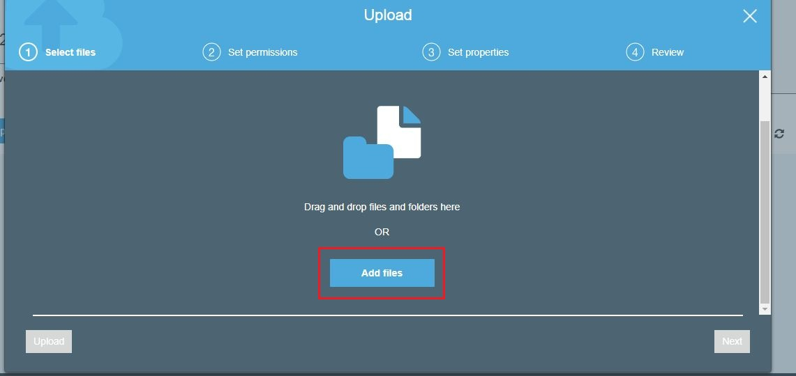
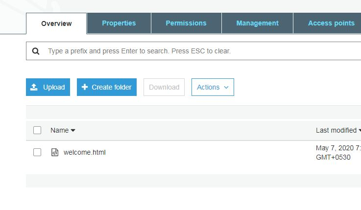

# Security group
   A security group acts as a virtual firewall that controls the traffic for one or more instances.

# security group rules
- The rules of a security group control the inbound traffic that's allowed to reach the instances that are associated with the security group.
- The rules also control the outbound traffic thats allowed to leave them.

# s3 storage
   Amazon Simple Storage Service(Amazon s3) is an object storage service that offers industry leading scalability,data availability, security and performance.
   This means customers of all sizes and industries can use it to store and protect any amount of data for a range of use cases, such as websites, mobile applications, backup and restore, archive, enterprise applications, IoT devices, and big data analytics.
   Amazon S3 provides easy-to-use management features so you can organize your data and configure finely-tuned access controls to meet your specific business, organizational, and compliance requirements.
   
   
reference:https://aws.amazon.com/s3/

# Creating a bucket in AWS:
## Step 1:

  On the AWS Management Console, click on the Services menu. Select S3 from Storage section. Storage section is also available on the dashboard itself. One can also search S3 directly from the Search bar provided on the dashboard.

## Step 2:

Selecting S3 would direct you to Amazon S3 console. Select Create Bucket here.

## Step 3:

In Create Bucket, type a bucket name as per mentioned rules. This bucket name must be unique globally across Amazon S3 service. Leave the other configurations to default for now. Hit Create bucket.

## Step 4:

Once the bucket is created, your empty bucket would appear on the console. Click on your bucket to Upload files in it. Upload or Create folder options would come up on the screen.

## Step 5:

Click on Upload to directly add files in the parent bucket. You can choose Create folder to create another bucket within your parent bucket. The Uploading process still remains the same.

## Step 6:

On clicking on Upload, your console would provide you two options to add files to your bucket. You can either Drag and Drop files or choose Add Files button below. Click on Add Files and select the file you want to upload in your bucket. Once done, click on Upload button on the bottom left.

## Step 7:

The file that you've uploaded would appear in the bucket you chose to upload.

